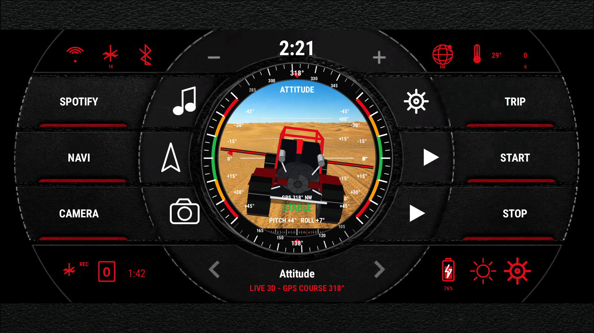
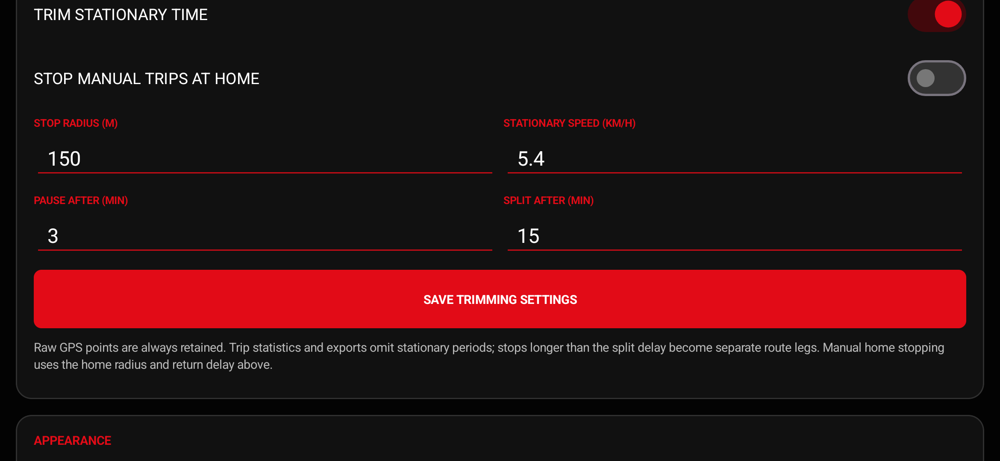

# GMODE Trip Recorder User Guide

## Dashboard

The app opens directly into a full-screen landscape cockpit. It uses a fixed 1280 x 592 reference grid and uniform fit scaling, so different screens may add narrow black letterbox areas but never distort the circular gauge.

While the cockpit is visible, GMODE requests high-accuracy foreground location and GNSS status so speed, altitude, course, accuracy, coordinates, and satellites remain live at home and before a trip begins. These foreground samples are display-only; the app saves route points only during a manual or automatic trip. Monitoring stops when the app is no longer visible.

Select **GPS sky + position** under the gauge settings to see every visible satellite placed by its real azimuth and elevation around your centred position. Green satellites have strong signal, amber are fair, red are weak, and a white outer ring means Android is using that satellite in the current fix. The translucent centre circle visualizes horizontal uncertainty; the readout also combines used/visible counts, accuracy, speed, coordinates, altitude, and course. Older GPS Satellite, GPS Accuracy, and Coordinates selections migrate automatically to this single gauge.

### Top and corner indicators

- **Clock:** current phone time.
- **Wi-Fi:** whether the phone has a validated Wi-Fi connection.
- **GPS/satellite:** GPS readiness and satellites used in the fix.
- **Bluetooth:** live Bluetooth state. Tapping it requests Nearby devices permission when Android requires it.
- **Globe/HA:** network and configured Home Assistant availability.
- **Thermometer:** S24 battery temperature.
- **Bottom-left status:** recording state/trip type and elapsed time.
- **Bottom-right battery:** charge state and percentage.
- **Sun:** cycles the dashboard colour theme.
- **Gear:** opens settings.

### Six side buttons

The left and right controls are real launch/action buttons. Their icons follow a radial arc around the main gauge. Factory defaults are Spotify, Navi, Camera, Trip, Start, and Stop. Each label, icon, and target can be changed under **Left + right dashboard buttons**. A target can be any launchable installed app or a built-in action: start, stop, trip type, automatic settings, sync, Home Assistant settings, app settings, radio/audio, navigation, music, camera, phone, browser, or installed-app settings.

### Gauge navigation

Tap the left or right footer arrow to cycle through every enabled gauge. There is no navigation limit; the sequence wraps at both ends and follows the order saved in **Cockpit layout**.

### 3D Attitude gauge

Mount the phone in landscape with the back of the phone facing forward. The vehicle and theme-coloured horizontal line follow mirrored roll in the same screen direction. Pitch changes the vehicle attitude and horizon relationship. Older line positions fade by age to show recent rotation history; the current line remains fully visible behind the vehicle.

The side arcs are the +/-45 degree roll scale. Top and bottom arcs show current and reciprocal GPS/magnetic course. GPS course is preferred at 5 km/h or faster; magnetic course gives smooth in-place heading below that speed. At the configured caution angle the complete outer bezel turns orange. At the limit it turns red and pulses.

Drag inside the gauge to orbit the 3D model. **Chase** returns to the high rear view after release, **Free orbit** keeps the chosen view, and **Locked high rear** disables orbit.

## Record a manual trip

1. Use **Trip** to cycle Street, Off road, Snow, or Water, or select the type on the settings screen.
2. Press **Start**.
3. Review the location disclosure and allow precise location. Android 13+ asks separately for notification permission so the recording service can show its persistent status.
4. Confirm the bottom-left recording indicator and timer are active.
5. Press **Stop** to finish. The trip remains in the local database and synchronization is queued.

Recording does not depend on Home Assistant connectivity.

## Automatic recording

Automatic recording is off by default.

1. At home, open settings and press **Use current location**.
2. Optionally press **Use current Wi-Fi**, or use **Choose Wi-Fi in Android** first and capture the newly connected SSID.
3. Enable **Start when I leave home** and select the automatic trip type.
4. Adjust the radius, delays, GPS interval, and minimum movement if necessary.
5. Press **Save automatic settings**.
6. When Android app settings open, choose **Permissions > Location > Allow all the time**.
7. Return and save again. Confirm the app reports that automatic departures are armed.
8. Open **S24 battery settings**, set the app to unrestricted, and remove it from sleeping/deep-sleeping lists.

Hybrid mode uses Wi-Fi departure as an early signal and GPS as the physical boundary check. Loss of Wi-Fi by itself does not start a trip while the GPS fix remains inside the home radius. A GPS exit can still start a trip when Wi-Fi is unavailable. Return dwell avoids stopping during a brief pass near home. Android will not deliver background events after the user force-stops the app; open it once to re-arm.

## Trim stationary time

Open **Settings > Stationary trimming**. The recommended defaults are trimming and auto-pause enabled, 150 m stop radius, 5.4 km/h stationary speed, pause after three minutes, and split after 15 minutes.

On an automatic trip, **Auto-pause while stationary** switches from high-rate GPS and telemetry to a low-power movement watch after the configured delay. Accurate movement resumes the same trip, including after Android recreates the app process. This prevents a work or shopping stop from ending the trip while avoiding hours of parked telemetry and battery use. Manual trips are not automatically paused.

GMODE never deletes source fixes already stored. It derives moving statistics and route legs from the raw track and records a pause boundary when movement resumes. A short confirmed stop pauses elapsed driving time and removes GPS drift from distance. A stop longer than the split delay begins a new route leg when movement resumes. Disable trimming when you specifically need one continuous raw timeline.

Enable **Stop manual trips at home** if trips started with **START** should also finish after remaining inside the saved home zone for the configured return delay. This option requires the same saved home point and Android background-location permission as automatic recording.

## Scene and vehicle mapping

| Trip/scene | 3D vehicle | Gauge background |
| --- | --- | --- |
| Street | Truck | Road |
| Off road - dirt | SxS | Dirt/rock terrain |
| Off road - sand | Sand rail | Sand dunes |
| Snow | Snowmobile | Snow trail |
| Water | Mini jet boat | Open water |

## Calibrate level

Park on flat ground, stop completely, and leave the S24 in its normal mount. Open **Cockpit layout** and press **Calibrate Pitch + Roll Zero**, then release the phone. The app samples for two seconds and rejects a moving or rotating phone. A successful calibration saves mount-specific pitch/roll offsets.

## Export a trip

Open **Export recorded trip**, select a saved/active trip and a format, then press **Export trip file**. Android's Save dialog chooses the destination. When stationary trimming is enabled, exports contain the derived moving legs; the local database and Home Assistant upload still retain all raw points.

- **GPX:** route, elevation, timestamps, accuracy, speed, bearing, and satellites for navigation/trail apps.
- **KML:** timestamped track for Google Earth.
- **GeoJSON:** MultiLineString plus trip metadata and arrays for GIS/map tools.
- **CSV:** every retained moving-point telemetry column plus route-segment index for a spreadsheet or analysis tool.

## Home Assistant

Open **System > Home Assistant connection**, enter the URL and a long-lived access token, and press **Save connection**. Use **Sync now** to queue immediate work. See [Home Assistant setup](HOME_ASSISTANT_SETUP.md) for the server component and troubleshooting.

The **HA control + updates** card lets you request an immediate check and displays the most recent HA notice, applied control revision, and available version. The phone reports sync/GPS/permission/battery health and a bounded recent event log to your own HA server every 15 minutes when online and during normal sync activity. HA can return notices, safe `sync`/`rearm` commands, bounded automatic-recording settings, and update metadata. Update downloads always require your confirmation; HA cannot silently install software or run arbitrary code on the phone.

## Privacy and deletion

Use **System > Privacy + data use** to read the in-app summary or open the full policy. To remove all phone-held trips and settings, use Android **Settings > Apps > GMODE Trip Recorder > Storage > Clear data**, or uninstall. Delete synchronized/exported copies separately.
